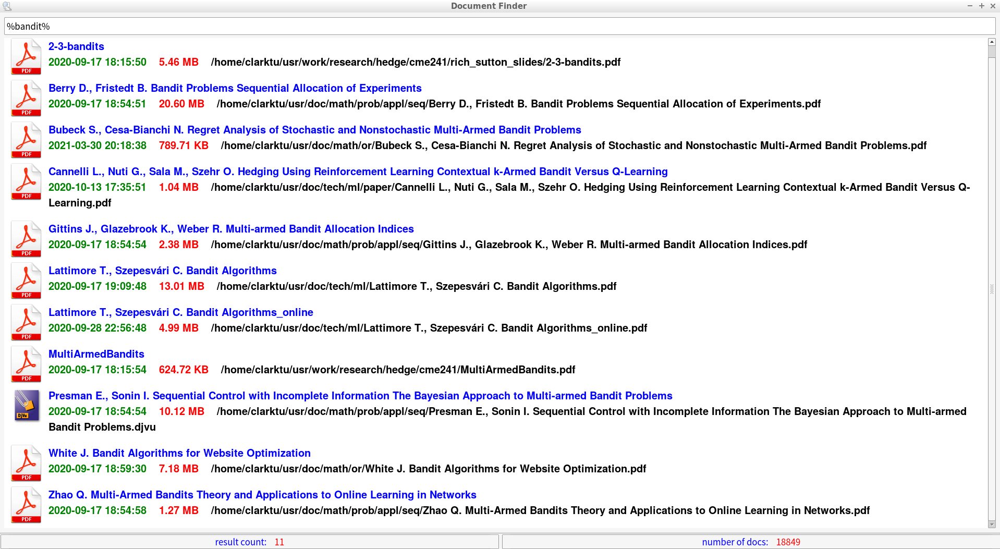
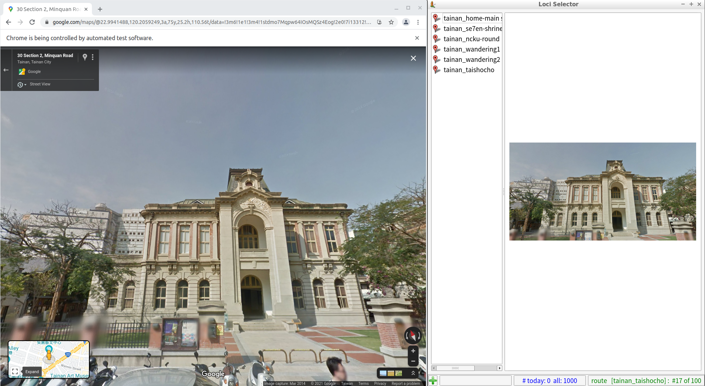
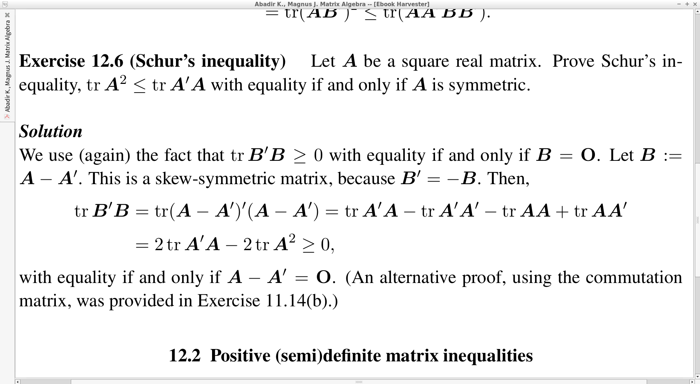
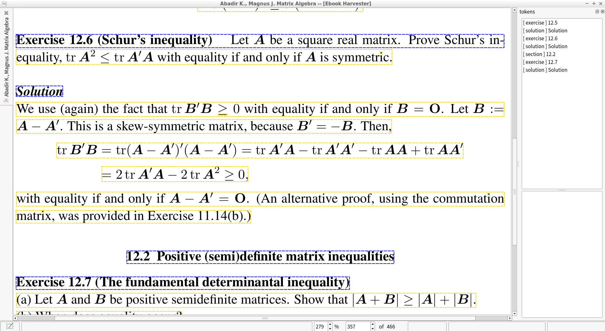
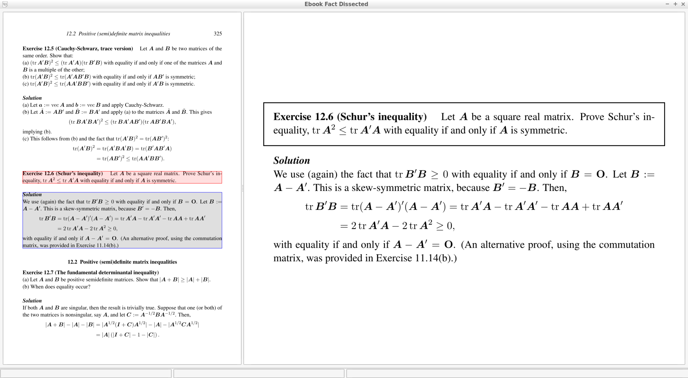
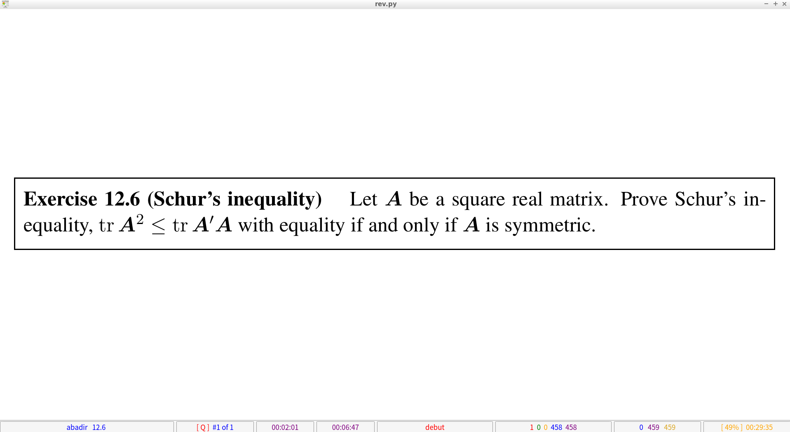
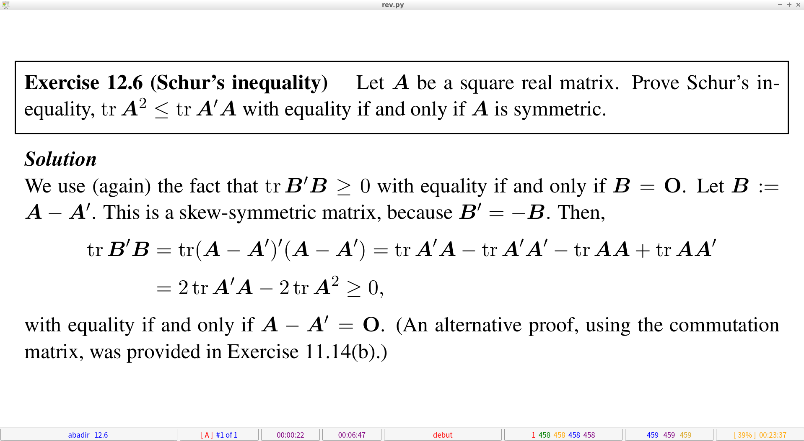
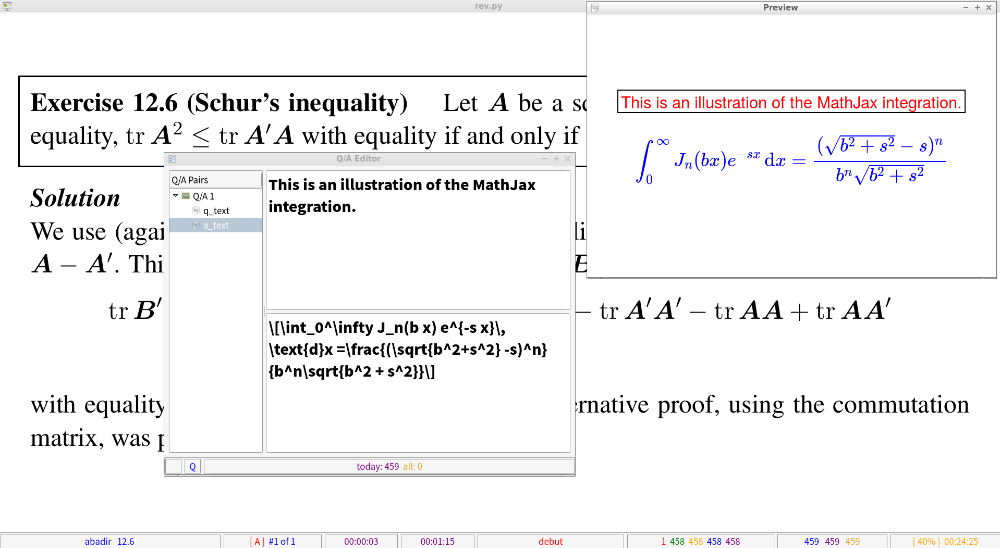
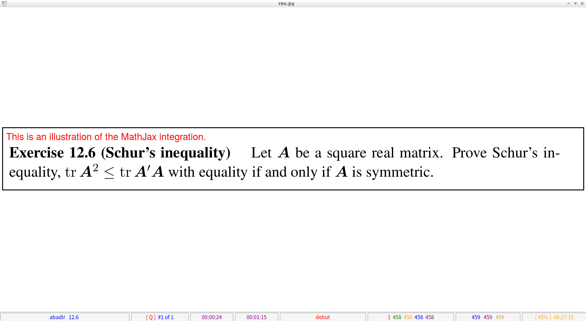
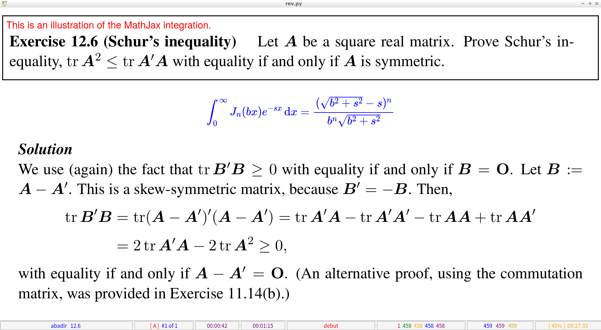

Ānanda 
======

A collection of adaptive computer-assisted learning / memorizing subroutines.

## Content 
* [Screenshots](#screenshots)
* [Install](#Install)
* [TODO](#TODO)

## Screenshots
<p align="center">
  Lightweight Indexer "Document Finder" Using SQLite and PyQt5 + QtWebEngine. (<a href="https://github.com/chang-ye-tu/ananda/blob/master/doc_finder.py">doc_finder.py</a>)<br/><br/> 
  <kbd></kbd>
</p>

<p align="center">
  "<a href="https://en.wikipedia.org/wiki/Method_of_loci#:~:text=The%20method%20of%20loci%20(loci,palace%2C%20or%20mind%20palace%20technique.">Method of Loci</a>" Loci Selector by Leveraging Google Street View, Chromedriver and D-Bus. (<a href="https://github.com/chang-ye-tu/ananda/blob/master/loci.py">loci.py</a>)<br/><br/>
  <kbd></kbd>
</p>

<p align="center">
  Incremental Reader: PDF / DJVU Reading with Theorem Extract and Automated Review. (<a href="https://github.com/chang-ye-tu/ananda/blob/master/hrv.py">hrv.py</a>)<br/><br/>
  <kbd></kbd>
</p>

<p align="center">
  Incremental Reader as a Theorem 'Harvester': Binary Morphology + OCR. (<a href="https://github.com/chang-ye-tu/ananda/blob/master/hrv.py">hrv.py</a>)<br/><br/>
  <kbd></kbd>
</p>

<p align="center">
  Incremental Reader as a Theorem 'Harvester': Parsing and Rendering. (<a href="https://github.com/chang-ye-tu/ananda/blob/master/hrv.py">hrv.py</a>)<br/><br/> 
  <kbd></kbd>
</p>

<p align="center">
  Automated Review: Showing the Question (Left) and the Answer (Right). (<a href="https://github.com/chang-ye-tu/ananda/blob/master/rev.py">rev.py</a>)<br/><br/> 
  <kbd></kbd>
  <kbd></kbd>
</div>

<p align="center">
  Automated Review in Action: Add some LaTeX via MathJax with Preview. (<a href="https://github.com/chang-ye-tu/ananda/blob/master/ed.py">ed.py</a>)<br/><br/> 
  <kbd></kbd>
</p>

<p align="center">
  Automated Review: Showing the Question (Left) and the Answer (Right) with LaTeX. (<a href="https://github.com/chang-ye-tu/ananda/blob/master/revv.py">rev.py</a>)<br/><br/> 
  <kbd></kbd>
  <kbd></kbd>
</div>

## Install
- Required libraries / utilities
  - OS: Linux (Although most components are portable)
  - Programming Language: Python 3.7+, C++ 
  - GUI: [Qt]( https://www.qt.io/ ) / [PyQt5]( https://riverbankcomputing.com/software/pyqt/download ), [D-Bus]( https://www.freedesktop.org/wiki/Software/dbus/ ) 
  - OCR: [Tesseract]( https://github.com/tesseract-ocr/tesseract ), [OpenCV]( https://opencv.org/ ), [Leptonica]( http://www.leptonica.org/ ) 
  - Document: [Poppler]( https://poppler.freedesktop.org/ ), [DjVuLibre]( http://djvu.sourceforge.net/ ) 
  - Audio / Video: [PortAudio]( http://www.portaudio.com/ ) / [PyAudio]( https://people.csail.mit.edu/hubert/pyaudio/ ) 
  - JavaScript: [MathJax]( https://www.mathjax.org/ ) 
  - Other Utilities: [ChromeDriver]( https://sites.google.com/chromium.org/driver/ ), [Vim]( https://www.vim.org/ ) 
- Issue the following commands (for Ubuntu 20.04) 

```shell
sudo apt install python3-djvu python3-xlib python3-poppler-qt5 python3-pyaudio pyqt5-dev-tools python3-pyqt5-qtwebengine python3-pyqt5-qtmultimedia libleptonica-dev djvulibre-bin poppler-utils libopencv-dev tesseract-ocr build-essential cmake git vim-gtk3 python3-pip pdftk libboost1.71-all-dev qt5-default google-chrome-stable gstreamer1.0-plugins-bad gstreamer1.0-plugins-ugly ffmpeg libopencv-dev

pip3 install apscheduler beautifulsoup4 selenium
```
- Install MathJax (with root repository in $BIN)

```shell
cd $BIN && git clone https://github.com/mathjax/MathJax.git mj-tmp && mv mj-tmp/es5 $BIN/mathjax && rm -rf mj-tmp
```

## TODO
* Adaptive scheduling algorithm improvements (ongoing research)
* Code cleanup 
